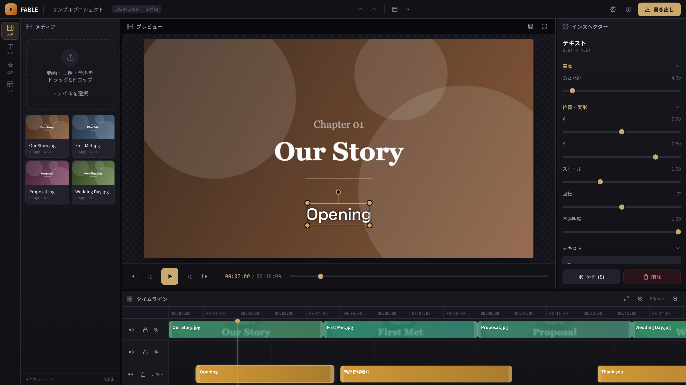

# FABLE - 結婚式ムービー編集

ブラウザ完結型のタイムライン動画編集Webアプリ。CapCut / Premiere Pro クラスの編集機能を結婚式ムービー制作向けに最適化。

**デモ**: https://shunsukesaito00.github.io/mvmake/

> 公開には GitHub Pages の有効化が必要です(Settings → Pages → Source を「GitHub Actions」に設定)。
> デプロイ状況は Actions の「Deploy to GitHub Pages」で確認できます。

## スクリーンショット



スクリーンショットは `npm run screenshot` で自動生成できます（サンプルプロジェクトを開いたエディタ画面を撮影して `docs/screenshot.png` を更新します）。

## 機能

### タイムライン編集
- マルチトラック（映像×2、テキスト、BGM）
- クリップ移動・トリム・分割・複製・コピー&ペースト
- リップル削除・リップルトリム、重なり防止、スナップ
- トラックミュート/ロック
- プレイヘッドドラッグ、タイムラインフィット
- マーカー（章 M / ビート Shift+M）、In/Out点
- BGM ビートマーカー（等間隔配置・スナップ連動）

### 映像・音声
- 動画・画像・音声インポート（500MB超は警告、合計使用量表示）
- 写真一括配置（スライドショー生成: 表示秒数・トランジション・Ken Burns指定）
- 動画クリップ音量、再生速度（0.25x〜4x）
- 色調補正（明るさ・コントラスト・彩度・トーンカーブ・RGB カーブ（PCHIP・自由制御点）・HSL）・3D LUT（.cube インポート、Canvas ミニプレビュー、ルックプリセットと併用可）
- クロップ、Ken Burns（ズームパン）
- BGMフェードイン/アウト、BGMダッキング（動画音声区間で自動減衰）

### テキスト・効果
- 結婚式プリセット（Opening / プロフィール / Thank you / エンディング + ロワーサード 15 種・テロップ 22 種・MG 16 種、計 44 種）
- テキスト詳細編集（縁取り・影・配置）
- テキストアニメーション（fade / slideUp / typewriter / scaleIn + MG 複合 16 種 + カスタムキーフレーム）
- トランジション29種（クロスフェード、ディゾルブ、ブラーディゾルブ、フェード、暖色フェード、ライトリーク、ソフトフォーカス、暖色ディゾルブ、フィルムバーン、ジェントルズーム、花びら舞、ゴールドシマー、ソフトワイプ、キャンドルグロー、ドリーミーブラー、紙吹雪、シルクフェード、スターライト、レースリビール、パールシマー、ミストフェード、リボンカット、ワイプ、スライド、ズーム、アイリス）+ ミニプレビュー

### プレビュー・書き出し
- Canvasリアルタイムプレビュー
- プレビュー上のビジュアル編集（移動・スケール・回転、Shiftで15°スナップ）
- セーフエリアガイド、フルスクリーン
- In/Out範囲ループ再生・範囲書き出し
- MP4書き出し（1080p / 720p、品質3段階: 16/8/4Mbps）
- 書き出しプリセットの保存・適用・JSON 共有（`.fable-export-preset.json`）

### その他
- Undo/Redo（50履歴）
- IndexedDB自動保存、複数プロジェクト管理
- `.fable` ファイルでのバックアップ/共有
- 結婚式テンプレート（オープニング/プロフィール/エンディング/構造化フル構成）
- プロジェクト設定（解像度、FPS、リップル編集、ループ再生、設定プリセット JSON 共有）
- リサイズ可能なパネルレイアウト（設定を保存）
- PWA対応（インストール・オフライン起動、maskableアイコン）、初回オンボーディングガイド
- サンプルプロジェクト（オンボーディングから1クリック、メディアなしで編集体験）
- ショートカット一覧モーダル（`?` キーまたはヘルプボタン）
- J/K/L 再生ショートカット（J=1秒戻る / K=停止 / L=再生）
- スリップ/スライド編集（,/. で素材オフセット、[ / ] で隣接クリップ連動、Ctrl/Shift+ドラッグ）
- インスペクター未選択時のクイックスタート（テキスト追加・メディアインポートへの導線）
- 空プロジェクト時の書き出しガード（クリップ0件で disabled）
- 音量キーフレーム（AudioClip / VideoClip、インスペクター + タイムライン上ドラッグ編集・スナップ・Shift 軸ロック）
- 速度キーフレーム（VideoClip、スロー/早送りランプ、インスペクター + タイムライン）
- 調整レイヤー（章全体への色調一括適用、ルックプリセット対応）
- オーディオ 3バンド EQ（低域/中域/高域、BGM・動画音声）
- オーディオノイズ除去（ハイパス/ローパス/簡易ゲート、BGM・動画音声）
- カラールックプリセット（結婚式向け 22 種ルック・ユーザー保存・JSON 共有・Canvas ミニプレビュー（ピクセルグレード整合））
- 映像クリップのフェードイン/アウト
- 書き出し解像度のプロジェクト整合（4K / 正方形 / 縦型9:16ネイティブ書き出し）
- テキスト複数行描画（改行対応）
- テキスト行間・縦配置の詳細設定
- 写真ガイド連動スライドショー配置（構造化テンプレ向け）
- テキスト背景・字幕帯（半透明背景・余白・角丸）
- 章マーカー区間の部分書き出し（In/Out 連動）

**現在のバージョン**: v2.6.17

詳細な機能比較・ロードマップは [docs/FEATURE_COMPARISON.md](docs/FEATURE_COMPARISON.md) を参照。

### v1.5〜v1.24 で追加された主な機能

- ナレーション録音（マイク権限エラー時の案内・再試行）・SRT/VTT 字幕入出力（SRT は UTF-8/Shift_JIS 等を自動判定・長文折り返し）・メディア差し替え（映像↔画像含む）
- 章マーカー部分/一括 ZIP 書き出し（章ごと逐次 ZIP 化）・Google Fonts（選択時逐次ロード）・メディア検索/ソート
- ユーザーテンプレート保存・JSON 入出力・プロジェクト設定プリセット
- タイムラインズーム/ナビゲーション改善・書き出し UX（ETA・キャンセル後復帰）
- BGM/ナレーション音量正規化
- トランスフォームキーフレーム（位置・スケール・回転・不透明度・イージング・ベジェ補間・全属性重ね表示・グラフエディタ数値直打ち・分割再配分・タイムライン UX）
- 音量キーフレームの splitClipAt 再配分
- J/K/L 再生ショートカット・リップルトリム
- ロワーサード/テロッププリセット拡充・BGM ビートマーカー
- カラールック 22 種・トランジション 29 種（ウェディング向け18種）
- 速度キーフレーム（VideoClip、プレビュー・書き出し整合・ベジェ補間）
- 調整レイヤー（下位トラックへ色調を一括適用）
- オーディオ 3バンド EQ（プレビュー・書き出し整合）

## 起動

```bash
npm install
npm run dev
```

## テスト

```bash
npm test          # ユニットテスト (Vitest)
npm run test:e2e  # E2Eテスト (Playwright、初回は npx playwright install chromium が必要)
npm run test:e2e:prod # 公開環境(GitHub Pages)に対するスモークE2E（basic 636 シナリオ）
npm run screenshot # README用スクリーンショット生成
```

## デプロイ (GitHub Pages)

main ブランチへの push で `.github/workflows/deploy.yml` が自動実行されます（build → deploy → 公開環境へのスモークE2E）。
リポジトリの Settings → Pages → Source を「GitHub Actions」に設定してください。

連続 push すると Pages デプロイが競合しやすいため、変更はまとめて push し、Actions で deploy → smoke の完了を確認してから次の push を行ってください。

## ショートカット

| キー | 操作 |
|------|------|
| Space | 再生/停止 |
| J / K / L | 1秒戻る / 停止 / 再生（Shift+J: 1フレーム戻る） |
| ← / → | フレーム送り |
| I / O | In点 / Out点 |
| M | 章マーカー追加 |
| Shift + M | ビートマーカー追加 |
| S | 分割 |
| Cmd+C/V | コピー/ペースト |
| Cmd+D | 複製 |
| Alt+ドラッグ | クリップを複製して移動 |
| Cmd+Z | Undo |
| F | フルスクリーン |
| G | セーフエリア |
| ? | ショートカット一覧 |

## 技術スタック

Vite + React + TypeScript / Zustand / Tailwind CSS / Canvas 2D / WebCodecs / Web Audio API / IndexedDB
